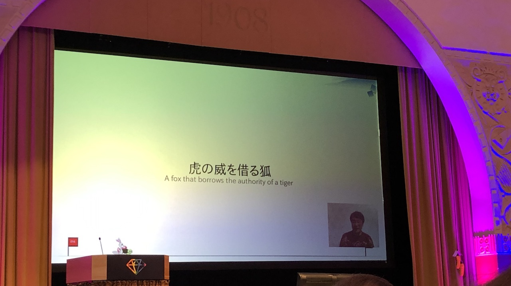
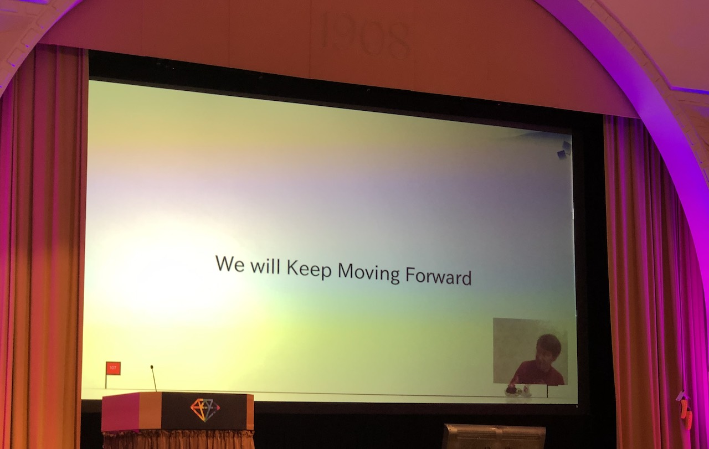

[👈 Back to all talks 👈](../README.md)

---

# Opening Keynote: MythBuster

## Yukihiro Matsumoto [@yukihiro_matz](https://twitter.com/yukihiro_matz)

There are a lot of *"nice"* people on the Internet. During early days of Ruby development Matz got a few emails like:

> Ruby is too good to be a scripting language

> Scripting languages do not need OOP

> Nobody uses Ruby. They use Python/PHP

> You shouldn't have created Ruby. We should focus on Perl

> Ruby is slow

> Ruby is dead every year

> Ruby is not <enter favourite language here>

Those people are irritating, not because they are talking bad about Ruby, but because they aren't completely fair. Their language of choice may be more popular, but that doesn't make them superior.

There is a website listing top Ruby companies. There are brands like airbnb, shopify, zendesk, gitlab etc. Those are all very valuable companies, some of them with $10B+ valuation. The same can be found when looking at 50 top software startups. Ruby is the top! used language there with over 50% ov valuation held by products built it Ruby.

### Will Static Typing become a thing?

As long as we create value we don't have to worry about the noise from the Internet. Ruby has its strengths. It has high velocity, which gives you a tool for quickly solving problems and deploying them. It may be more popular one year and less popular the next. There are many "trendy" things coming and disappearing. One year static typing is the hype, next year dynamic typing is.

There is TypeScript, PHP has type declaration, python has type annotations. What about Ruby? It may not need this at all.

It may seem like static typing is the "newer" thing because all the latest languages use it. Remember fortran? It was statically typed.

It may seem like static typing is "better". It has its benefits like better performance and IDE support, or being more self-documenting. But it comes with a few trade-offs as well. It's really verbose, redundant, comples and kind of forceful. And in the end there is an important question: do you really need type declaration? Static typing is obviously useful, but does it actually need type declarations?

### How does it look in Ruby now?

There are already a few gems with type signatures for Ruby and Rails. And there is `typeprof` that can generate new type signatures and can double as language server provider - making code completion easier. There is `steep` which cat perform type checks based on signatures.

Those tools provide most of the benefits mentioned earlier: comprehensive checks and better IDE support. And it doesn't need type declarations at all.

In a few years there may be a new trendy approach that would be "better" than static typing. Or languages without type declaration may become the popular ones again. Ruby may very well be one of those languages. 

Not adding type declaration *may be the right decision*. Maybe in a few years, maybe more :)

And there are some examples of languages that aren't statically typed which are extremely fast. Look at Google v8 JS engine. It's faster than most VMs out there and it doesn't need type declaration to be fast. You can have JIT compiler using Runtime Type Information which may give even more information than regular type declaration. The compiler can sometimes run faster than native compiled code, because it can perform some small optimizations with runtime information.

The new YJIT compiler is written in Rust which makes it easier to manage than the old one written in C. It now has arm64 support as well. And we have MJIT which has been rewritten in Ruby. It makes it easy to experiment with JIT.

### So what's new in Ruby 3.2?

- Ruby on WASM (Web Assembly)` - This lets you run Ruby code inside web browsers. 

- Improved memory allocation

- MaNy - N:M threading

- Data objects

- `syntax_suggest` gem

- `error_highlight` gem

- and support for many new tools

## Q&A

- What do you thing about `sorbet` and other tools for type checking?

  Before Ruby community moves to better approaches, `sorbet` is currently a good solution. Please also try ruby signature

- Are there Ruby features that you regret adding?

  Some features from Perl. Like global variables. Also adding threads very early in development was a big obstacle later.

- How developers can support Ruby for the next 100 years?

  It's hard to predict things in 5 years, so 100 years may be even harder. Ruby started as a hobby, but is now a community effort. It's important to keep building this community and building stuff together.

- Which area apart from typechecking should be improved in Ruby?

  We should focus on making things easier for programmers. We can improve productivity by providing the right set of tools around the language itself. 

- How to encourage gem authors to provide type signatures?

- What is the most enjoyable aspect of Ruby?

  Blocks in Ruby seem to be the great invention

- What other language would you pick if Ruby didn't exist?

  Maybe Julia or something like Lisp?

- Is contributing to open source important after many years of development?

  Writing software for customers is different from being open source developer. The later is much more enjoyable. It gives you a lot of freedom
