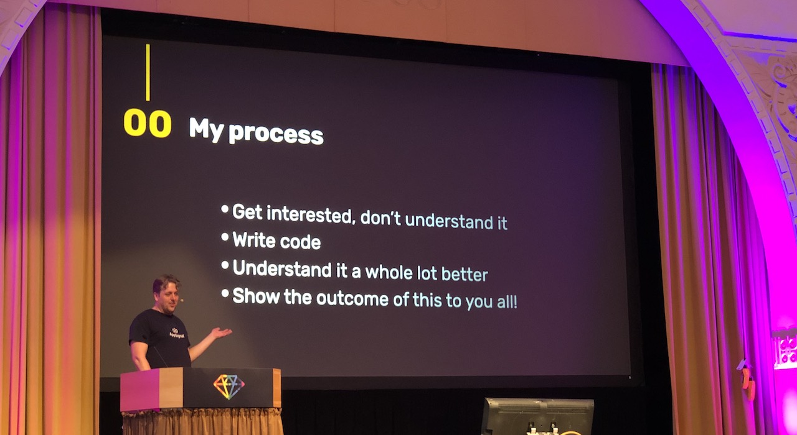
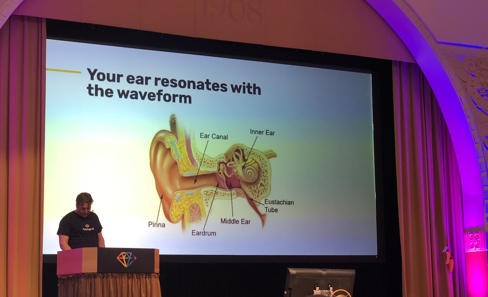
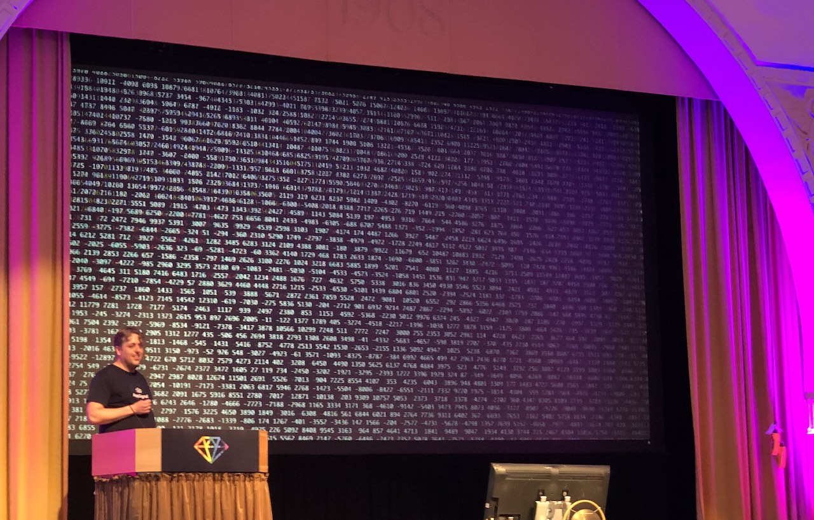
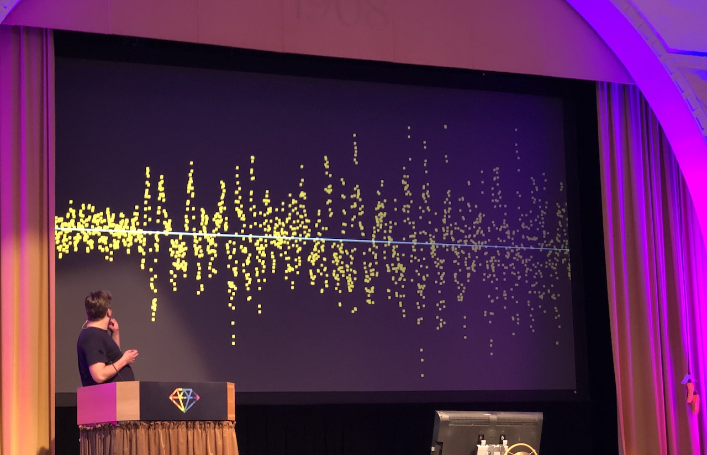

[👈 Back to all talks 👈](../README.md)

---

# How music works, using Ruby

## Thijs Cadier [@thijsc](https://twitter.com/thijsc)

There is some code available here 👉 https://github.com/thijsc/how_music_works

The world is a complicated things but we can try to understand it through well known technologies like Ruby. The process of understading things is easy:

1. Find something you don't understand
2. Write some code
3. Understand the thing better

### What is music made of?

Music is a bunch waveform that can be perceived by listener. There are different types of waves. We're interested in moving air from speaker to your ear. There are some *magic* processes happening in brain and then you hear music 💁‍♀️

There are a few components to sound:

- pitch
- timbre
- tempo

When you combine different setups of the three things above, you can already make simple music.

Music used to be 100% live in the past, but with technology came *recorded music*. We went from very rough first attempts at recording and first tools for playing recorded music, through casettes, CDs all the way to the current times where everything is handled by a computer. 

### How does digital audio work?

Unlike analog sound which is continuous, digital audio is just a bunch of samples played very quickly one after another. It's a quantized approximation of analog one. The simplest format is a wav, which is pretty much an array of output values. But it's hard to workr with such a big amount of data. To better visualize it we'll need some help from graphics libraries to visualize the waveform.

### How to make sound louder?

That's pretty easy. We want waverom to be "taller" - or more specifically have a bigger amplitude. Our initial approach would be to simply multiply all the values. But this results to some distortion, because loud parts are above maximum allowed value, so they are clipped - thus loosing some information.

### How to mix sounds?

Mixing allows us to go from fultiple simple waveforms to a single complex one - containing all of the individual ones. The simplest approach - just add the values together. To avoid clipping we can make all of the waveforms a bit queter.

### How to compress sound?

Tha'ts interesing one. By making things "less loud" you can make it sound louder. We pick a threshold and make everything louder than it a bit quierer. And make averything below a bit louder. In the end you end up with less aplitude between the quiet parts and the loud parts. To your ears the sound a a whole would sound louder, becuse the quiet parts can now be heard much easier.

### How to actually create a sound?

Back in the days people used synthesizers to create sounds. There are a few parts we need to implement to have full set of options:

1. Noise - This one is easy to do, just randomize a bunch of values. Why is noise usefull? If cut at the right time it can substitute some percussive sounds, such as a snare.
2. Square wave - Implementing this is basically implementing an oscilator. It needst to switch from a *high* value to a *low* value at regular intervals. This is a foundation for many sounds that could be created with a synthesizer
3. Sine wave - This one is self explanatory. We just follow the sine curve with time. This gives a *smooth* sound compared to square wave. Combine a few sine waves at different frequencies and you have a chord.
4. Timbre - achieved by combining two waves

## Q&A

- What are the common misconceptions about music that annoy you?

  Real musicians pretend like its really hard and soteric thing, but it's really not. You just need some math

- Can you play with vocals as well?

  Yes, same concepts apply

- How are overtones created?

  Overtone is when you have extra frequencies on top of your base one. This one would be easy to do as well

- Have you tried sonic pi?

  This is a cool program, that lets you create loops and actual music in Ruby

- How do you write tests for it?

  🤐
