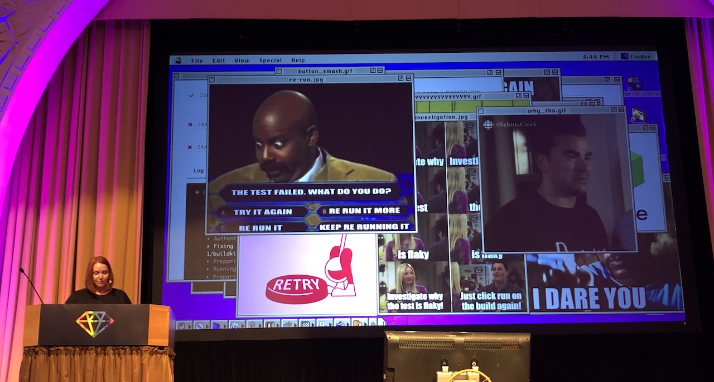
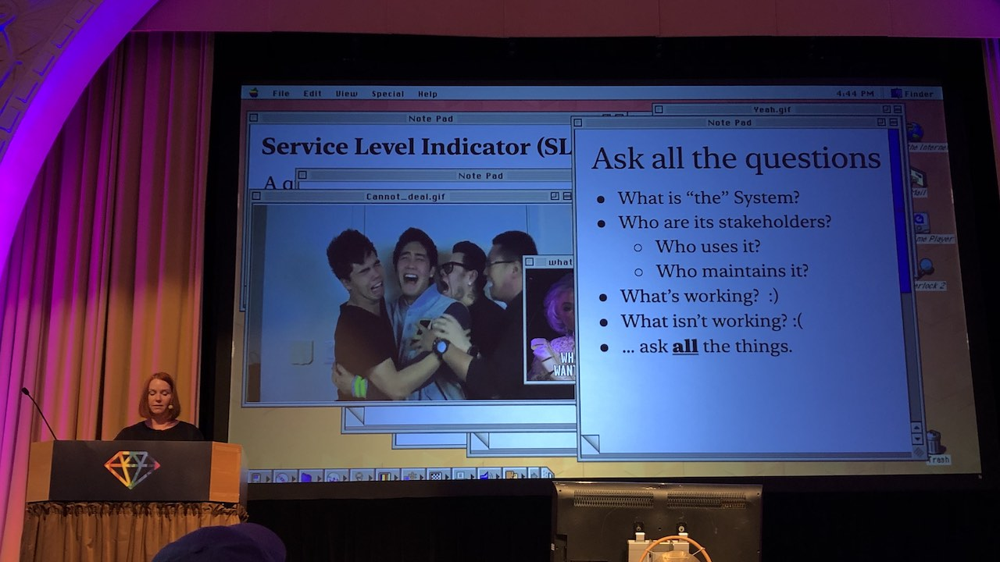

[👈 Back to all talks 👈](../README.md)

---

# Applying SRE Principles to CI/CD

## Mel Kaulfuss [@MelissaKaulfuss](https://twitter.com/MelissaKaulfuss)

There's always some drama when building software. We may have some huge monolith, and a lot of micro services and it's all hard to navigate. But it can be a great challenge.

Imagine you're building a big new feature, everything is ready, you merge your changes and wait for CI/CD to finish. But it fails - it's really underwhelming. "Boring deploys" that work are much better in that case. It may be tempting to keep retrying the build until it finally passes, but that's probably not the best approach.

Flaky tests may even cause your unrelated changes to not be deployed, because something somewhere is failing randomly. We need to be able to rely on our tests. Buildkite users spent over 9000 days in a single month in 2021 just retrying tests. That's a huge waste of time and money. Failing builds also break your flow, so instead of continuing to be productive it's easy to start slacking around.

### How can we mitigate this?

Google has published a book on their SRE (System Reliability Engineering) setup in production systems. That's a really good resource.

When you talk about SRE you can't avoid talking about "devops". Whats devops? It's a set of practices, guidelines and culture that helps break down silos in *software engineering, operations, networking and security*. Main principles are:

- remove silos
- accept that accidents happen
- embrace gradual change
- understand relation between tools and culture
- measurement is critical to success

On the other hand SRE focuses on practical side of things - making stuff work reliably. It has some principles as well:

- work towards automation
- bias systems towards availability, latency and efficiency
- observability is key
- don't pursue more reliability than actually necessary

Keep in mind that it's impossible to get 100% reliability.

### How can we put this in practice?

You can sometimes feel that the setup is just bad, there are some flaky tests and random build failures. The first step is to put good, reliable metrics in place.

> It is difficult to do your job well without clearly defining it well

There are two important metrics:

- SLI - Service Level Indicator
- SLO - Service Level Objective

They help shift mindset from taking all responsibility personally, and helps track issues.

First you need to figure out what and why you need to change. Then it's time to agree on some reasonable SLI, SLO and Error Budgets. For example:

- SLO - build start within x seconds
- SLI - total wait time for build
- Error Budget - 33 builds that finish in more than y minutes in a 4 week period

You may need to readjust the numbers until they fit what you're trying to achieve.

### How to measure?

There is a bunch of metrics monitoring tools such as Honeycomb, Datadog, Cloudwatch etc. When you start measuring your SLI it's now easier to know what should be your main focus.

Another method is to look at individual tests and find out what are the slowest ones and try to improve them. This helps you fine tune performance of your builds.

You may also want to measure reliability of individual tests, so it's easy to track down the most common causes of failures.

With the methods listed above it may be easier to work with technical debt. If things are slow but within your Error Budget you don't need to feel overwhelmed. Only when you pass the threshold it's time to take a closer look at those issues.

> SLOs are a powerful weapon to wield against micromanagers, meddlers and feature-hungry PMs

## Q&A

- Any tips on fixing flaky specs?

  There are usually integration tests which are realy hard to maintain

- How do you differentiate flaky tests from failing test (because of wrong code)?

  When you start using the right metrics tool you can see history and percentage of reliability score, so it's easier to filter things out

- What to do if a team is reluctant to introduce SLOs?

  Good strategy is to first match your current system metrics so there is no change needed
