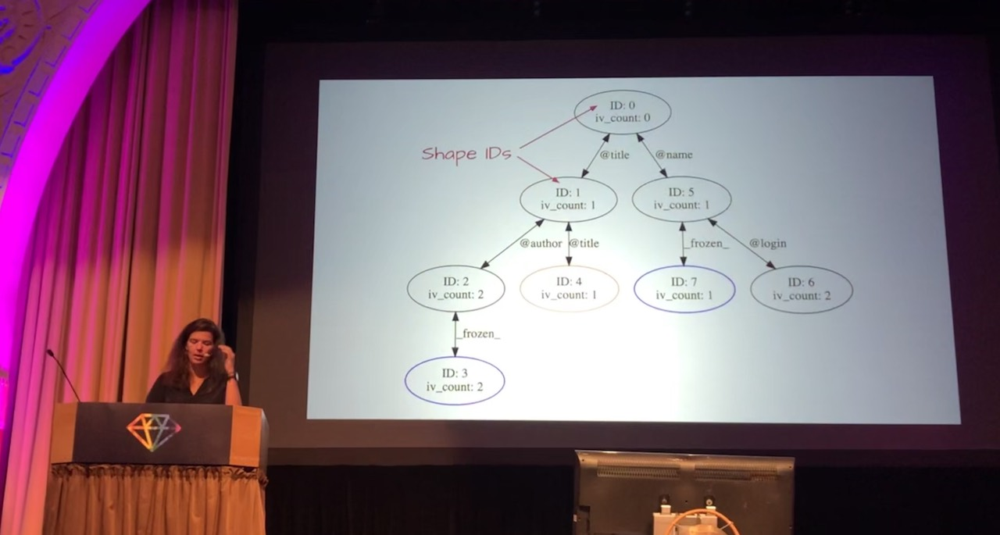

[👈 Back to all talks 👈](../README.md)

---

# Implementing Object Shapes in CRuby

## Jemma Issroff [@jemmaissroff](https://twitter.com/jemmaissroff)

We get a new Ruby version every year on Christmas. We get a bunch of new features every year: some are realy visible to end user, while others kind of hidden, optimisation, security and performance things.

Today we'll learn about one of the behind-the-scenes feature which is Object Shapes. We'll learn what they are, how they are implemented, adn what are their benefits.

### What are Object Shapes?

We're obviously not talking about actual shapes of actual objects. We're talking about Ruby Objects. And each object may have a set of properties - we'll cal them shapes. Object shape is a description of instance variables, frozen status, id etc.

It's important to distinguish between a class and a shape. *Objects of different classes may be of the same shape*. And objects actually change their shape during runtime. When setting a new instance variable we get a new shape. When we freeze the object we also get a new shape. This means that *two instances of the same class may have two different shapes*.

Each change to object properties may create a new shape. All objects usually start in the same shape of empty object and then change with time. This creates a tree-like structure of shapes with transitions between them.

### How are they implemented?

Shapes have unique ids. On 64 bit machines we can have up to 32 bits for shape ids, while 32 bit machines give 16 bits, which is still enough for many use cases.

Shapes are stuctures containing an ID, a list of out edges (transitions), number of instance variables, a type and a parent ID. This keeps them organized into a tree with transitions between shapes.

There are 4 shape types:

- root
- ivar - created from instance variable transition
- frozen shape - no more transitions will happen out of this
- undef - can be achieved by removing instance variables

### What are their benefits?

There are 4 key benefits:

1. Increased cache hits

   With object shapes we can take a different approach for setting instance variables. In Ruby 3.1 each instance of a class had an `instance variable array` with a lookup table for mapping variable names into indexes in instance variable array. This means we're doing hash lookups for all instance variable access. We're actually caching those lookups on a class level to make them faster. It works great most of the time, until we have another clas inheriting from the base class. It will have separate lookup cache.

   

   In Ruby 3.2 this lookup table will be replaced by ocject shapes lookup. Instead of using class as a cache key, we can use shape id as a key which will result in more cache hits. It also works great with inheritance.

2. Decreased code complexity

   Before introducing object shapes there were a lot of checks happening in `set_instance_variable` method. Checking if object is frozen, doing cache lookups with class comparison and in the end actually setting the variable. With object shapes we no logner need to compare classes for cache lookups, but instead just check shape id. The frozen status is also included in the shape, so we don't need to check for this in every call, just for the ones where we miss the cache

   There is another thing worth mentioning. When making new object instances Ruby wil pre-allocate some memory for instance variables. This memory is filled with `undef` which is in Ruby, but not exposed to end user. This helped track which variables were actually set. There was an overhead when creating new objects - we had to pre-fill the array.

   With object shapes we no longer have to do all of this. Shape tells us how many variables are actually used, so there is no checking required and no pre-filling.

3. JIT benefits

   With object shapes JIT is able to better optimize code because there are ferew instructions and comparisons happening

4. Performance gains

   In `RailsBench` Ruby 3.2 is faster and has more consitent speeds.

   In microbenchmarks we can see some improvements for select individual method calls

   
