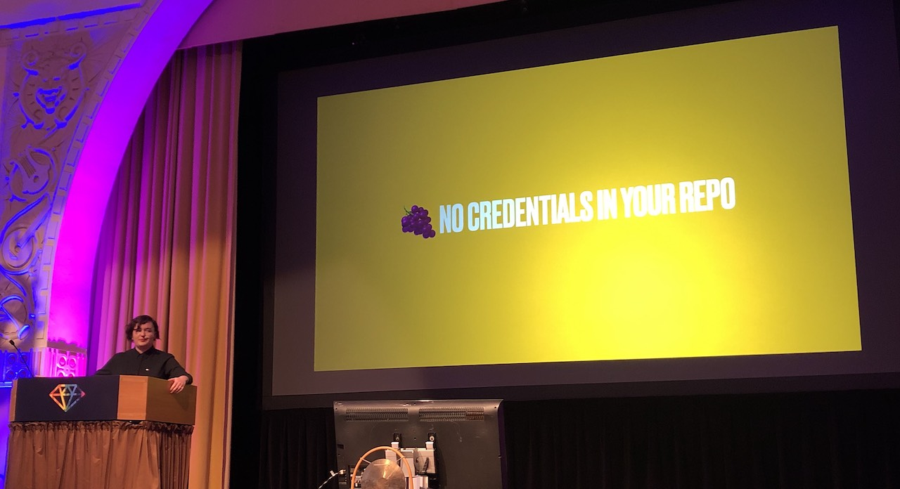
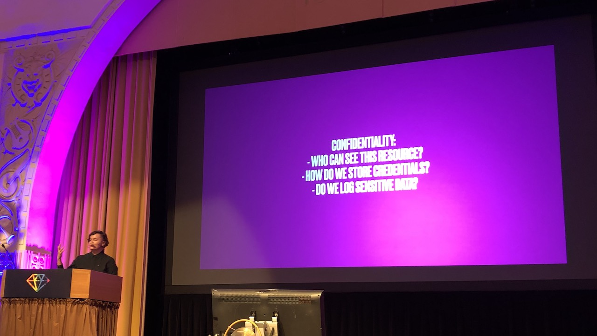
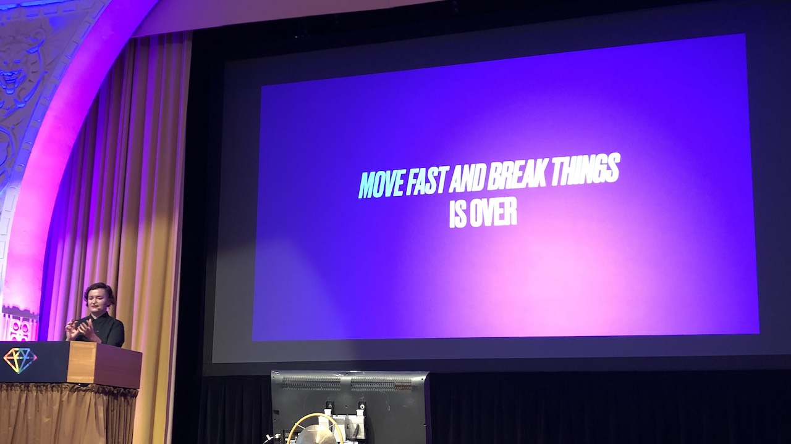

[👈 Back to all talks 👈](../README.md)

---

# Security Doesn’t Have To Be a Nightmare

## Wiktoria Dalach [@wdalach](https://twitter.com/wdalach)

Before shipping new feature you may have to run them by your security team. And they may bring up a lot of new issues you have't seen before. It seems like a bad idea to do this just before the release and not sooner. Is there something we can do about this?

There are a few low hanging fruits for improving your application security.

### Sanitize the input

You should never trust data from user inputs. Sanitization is removal of all potentially unwanted inputs. Obviously some used provided data is required for your application functionality, but we want to avoid giving opportunities for performing XSS (Cross Site Scripting) attacks etc

### Validate the data

The most important thing for users is that all their data stays safe and they don't loose access to them. Make sure the data is properly stored

### No credentials in your repo

No passwords, no API keys, no tokens - not even testing ones! Some tokens like this can give an attacker much more knowledge than you can imagine.

### How to approach the security?

With proper tools of course. Those tool are security scanning tools that automate security testing. There are two types:

- DAST - Dynamic Application Security Testing - tries to input malicious data into your application inputs and checks if it breaks
- SAST - Static Application Security Testing - looks at your code and searches for common mistakes

In the end security is quite hard, because it's a really wide topic: application, infrastructure, credentials management, mitigating vulnerabilities...

As a developer you need to keep track of all of those, which can become overwhelming and intimidating. And people working with security doesn't make things easier: they love to use acronyms, which all seem kind of similar. For newcomers it's really hard to understand all of this.

There are infinite amount of threats, but all of them can be put into 3 categories (the CIA triad):

- Confidentiality - we want secrets to be secret

  We don't want anyone to look at private information

- Integrity - we get what we expect

  You want to see the data you expect

- Availability - we can always access the information

  100% may not be possible, but it's worth trying to reach it

With this knowledge it's much easier to approach security-related issues. Just ask yourself a single question:

> How can the CIA of this project be broken

It's valid for all projects in all technologies. Think about each of the category above and you'll quickly end up with a overview of key security points.

### Real case

The product was validating VAT IDs using a govenment API. During the launch there was a huge inflow of new users creating accounts, so a lot of request were being made to this API. So many in fact, that the product got throttled and its API access limited. This hurt the app availability, because new users had isues signing up.

### Shift security left

Instead of doing security test on the on of project lifecycle it's wise to move it to an earlier stage. It's best when done as soon as possible - a lot of work can actually be done before code is created.

Fixing security issues once product is deployed and working in production is much harder and more expensive.

When you think about what type of sensitive data users may provide to your app it gets really obvious that security should take a high priority.

## Q&A

- What about storing encrypted credentials in repository?

  Secret management is a huge topic and there are different approachech - not familiar with this one

- How to apply CIA triad to an old triad?

  It can be done in small steps. Adding scanners could be a good start, and CIA triad can become part of the new process to ease-in. Things won't change overnight, but it can be a process

- How to properly manage credentials in big projects?

  It's a big effor to achieve consensus in a team. People may be reluctant to change, so it's not easy to introduce new setup for credentials management

- Specific DAST or SAST tools?

  Those tools usually cost money so they should be researched individually

- How can we guarantee secure practices in big teams?

  It's a mix of cultural and engineering priorities. Implementing automation may be helpful

- 3rd party auth provider vs building your own?

  Each one comes with some risks - it's a matter of choosing what's best for you
