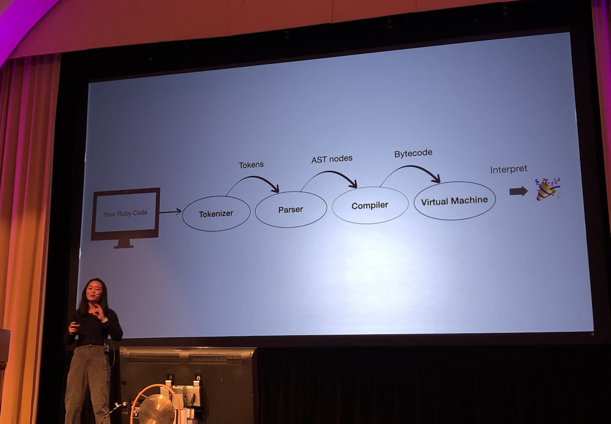
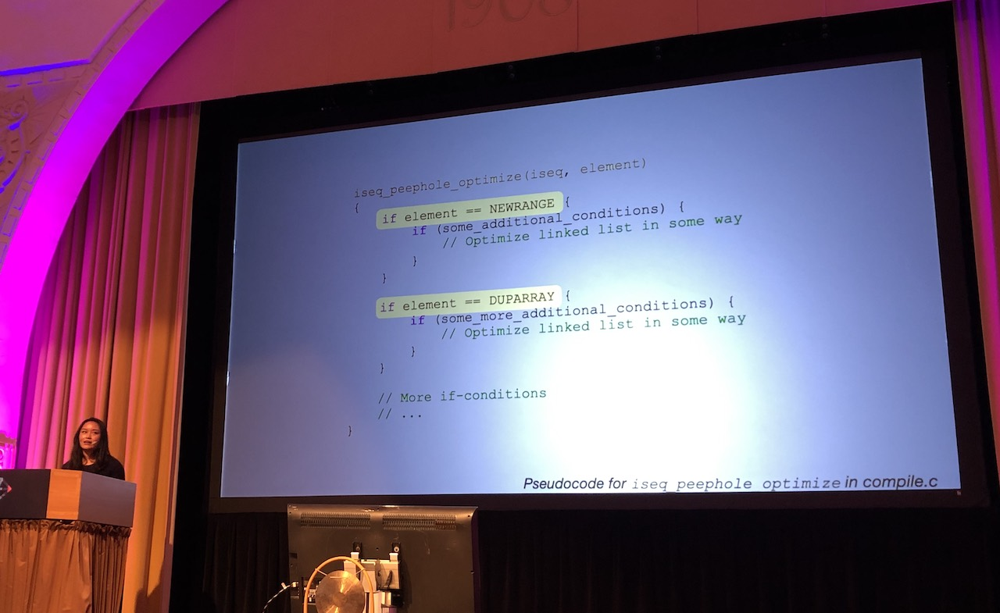
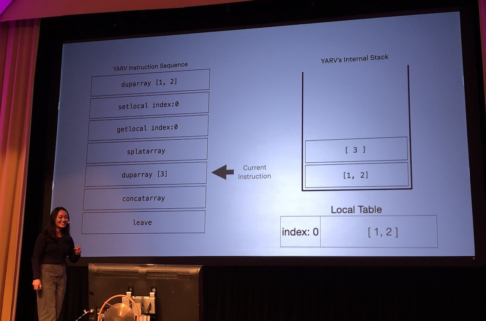
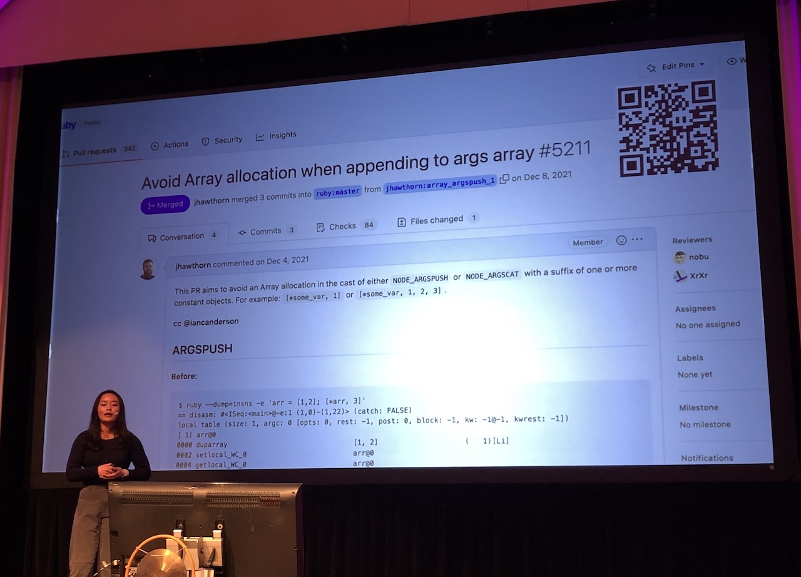

[👈 Back to all talks 👈](../README.md)

---

# Looking Into Peephole Optimizations

## Maple Ong [@OngMaple](https://twitter.com/OngMaple)

Peephole optimization is a technique originating in the 60s. We'll try to apply some of its principles to Ruby code. We may learn a little bit about how Ruby is compiled along the way.

### What is peephone optimization?

It's looking at several instructions at once and trying to optimize it so it's more performant. It's used in various other languages raging from Python to Asembly. We'll focus on MRI. And Ruby has such optimization already and it's turned on by default.

When does this optimization take place?



All of this happens when compiler is generating bytecode. It's important to know that bytecode is stored in a linked list form which can then be optimized.

### How does Ruby do this optimization?

In the optimization phase it goes over the instruction list and looks for *instruction sequences*. Those are things we can optimize with peephole optimization. All of optimization logic is described in `compile.c` method `iseq_peephole_optimize`. On a high level it stores a list of known optimizations that can be applied in specific cases. If such case is found in the instruction sequence it can be replaced with a more efficient one.



Afterwards, the instruction sequence should be smaller and more performant.

### Real-life examples

Let's take a very simple code snippet `("A"..."Z")`. Without peephole optimization the compiler would end up using 3 instructions:

- put "A" to stack
- put "Z" to stack
- pop two elements from the stack and put an inclusive range to the stack

How can it be optimised? With peephole optimization there is basically a single instruction:

- put a range to the stack

This small optimization makes a code 5x faster. This is optimized by *replacing code*.

Another example will be `[*["hello", "world"]]`. Without optimization we use 4 instructions:

- put "hello" to stack
- put "world" to stack
- remove 2 elements from stack and put an array of them to the stack
- pop 1 element from the stack (the array) and put back splattered version (which would be the same thing)

After optimization the last instruction is removed as it doesn't do anything here. This is example of *removing unnecesary code*.

Another example is *removing unnecesary instruction*. Take a look at:

```
x = "foo"
x = x
```

With no optimizations we'll end up with a set of instructions including: reading variable, duplicating memory pointers and assigning variable.

With optimizations turned on we skip unnecesary steps of reassigning the same value. Interestingly, in this case there isn't a huge difference. That because the instruction we've removed `dup` is a very simple and fast operation - so the benefit here is a simpler code.



Last example:

```
foo = [1,2]
[*foo, 3]
```

This would produce instruction sequence including array splattering, duplication and concatenation.

Optimization makes a single change: it creates new array instead of duplicating existing one which gives the same end result but is 1.26x faster.

### Are there limitations?

It obviously only applies to some specific bytecode. And since Ruby is a dynamic language it's sometimes hard to have enough information at compile time - code can be monkey patched which won't be known until actual execution.

In Ruby, all of those optimizations have to be found and written manually.



### How good is it in real life?

With peephole optimization we can get at least a few percent faster execution in well known benchmarks. In some cases the performance gained can even be a double digit number.
