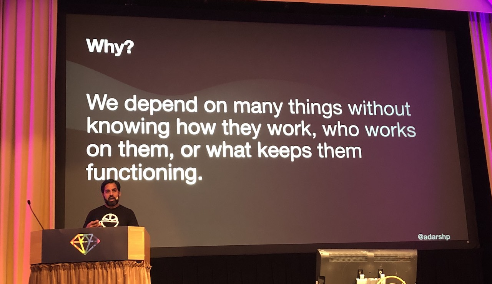
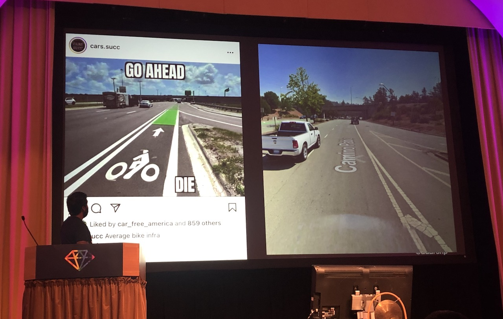
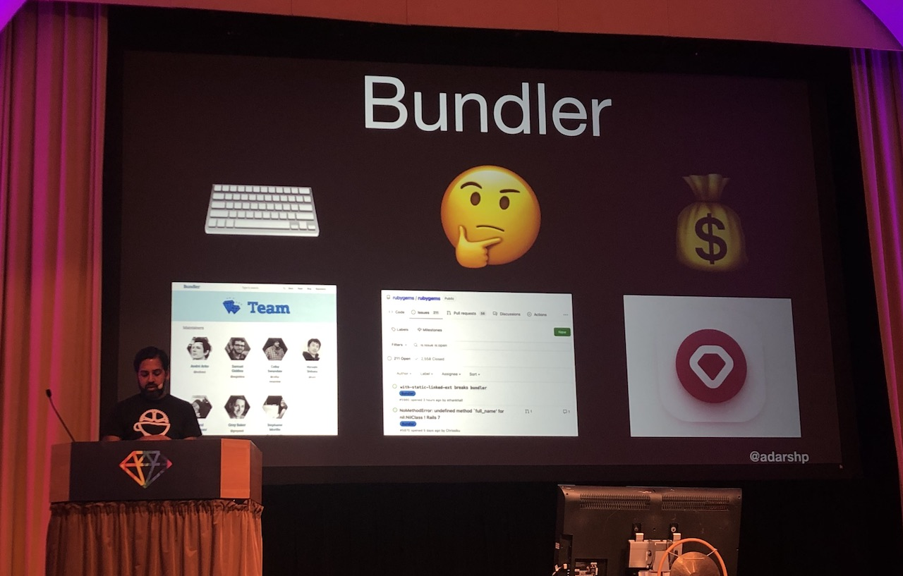

[👈 Back to all talks 👈](../README.md)

---

# The Technical and Organizational Infrastructure of the Ruby Community

## Adarsh Pandit [@adarshp](https://twitter.com/adarshp)

This talk will be an overview of critical Ruby infrastructure systems and try to serve as an inspiration to get involved with them.

It's important to remember that someone has to build and maintain Ruby Community Infrastructure.

> Thinking in Systems - Donella H. Meadows

First thing we should accept is that a system can never be "broken" because what it does is it's purpose. Systems can be of a varying complexity and purpose: we have AC systems, food delivery systems, computer programs, public infrastructure. They all have their purpose and if we don't like how they work, instead of blaming and saying that it doesn't work we can take a proactive approach and start changing things.

It's possible to have two systems that are seemingly doing the same thing, but are different from each other - that's because they are actually focusing on two different things. For example compare cycling infrastructure between Europe and USA. Both of them allow cyclists to move, but one is focusing on cyclists safety, while the other one is focused on still allowing cars to go as fast as possible - none of those is "broken", they just serve different purpose.

Each fatal car crash in Finland causes a panel of experts to gather and try to find and fix the underlying issue. We can learn a lot from the way those things are managed here.

### Bringing this to Ruby Community

We can think of a few important parts of Ruby Community Infrastructure: MRI, Rails, gems, bundler, ???

It's important to ask who maintains those, who funds them and how are decisions being made. Transparency creates accountability, which makes projects more roboust.

Let's start with MRI. When looking at the website it's not obvious who's maintaing this - there isn't a list of core contributors. For decision-making there are some processes described. Ruby has a succesful release every year, so it seem like this governance works good it this project. It has clear goals in mind and folows them. The last question is: who funds ruby development? There is no obvious answer.

Then we've got Rails. They have a list of core contributors, they have a great guide on contributing to the project. When it comes to governance: there's an ongoing effort to setup a team effort based governance. Who pais for it's development? There are a few well-known companies sponsoring Rails development.

What about Bundler? In 2013 there was a security incident involving rubygems. In a post-mortem it was made clear that this is a volunteer run project which is surprising since it's obviously one of the core parts of the ecosystem. Afterwards "Ruby Together" organization was created to maintain Bundler and RubyGems.

When it comes to gems it gets more complex. Each one is a separate project maintained by some individual or a group of people. There isn't a clear answer on how to govern those. We can dig even further and think about things like the community itself: all the conferences, meetups. Or learning materials, tutorials etc.

It's important to have a working governance in a community. It helps communities grow and still exist in the future. And the best way to  have people working on those core parts is to work on them yourself.

## Q&A

- What other communities do you admire the most?

  Many communities are volunteer-run, but there are two that are great examples. First one is Rust - it has all the governance details laid out clearly and easily accessible. The second one is Python - it used to be run in a similar way as Ruby until Duido resigned and left language development to community.

- What about the governance of ruby language specs? How can other ruby implementations follow the changes in MRI?

- What is the best way for companies to support bundler and other projects?

  Ruby Together is a good way of supporting some of the core ruby infrastructure