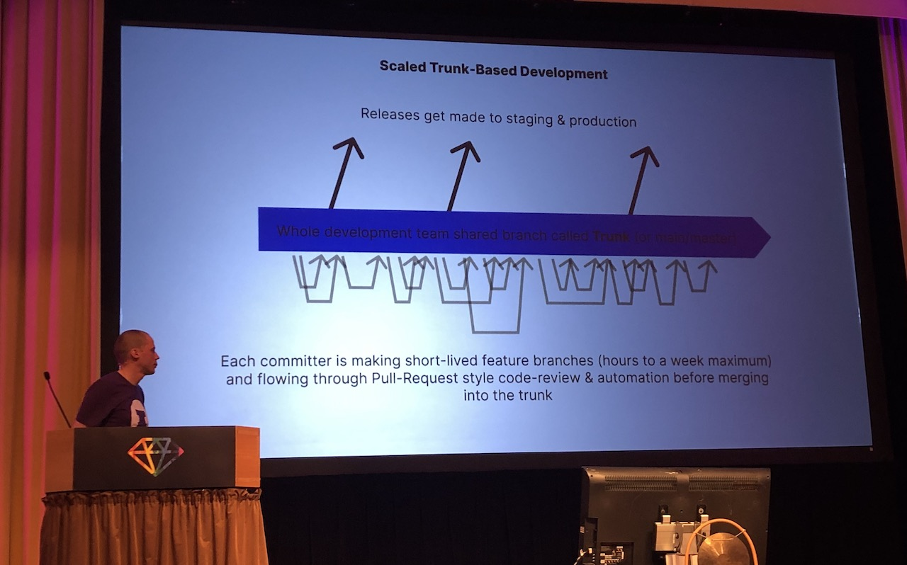
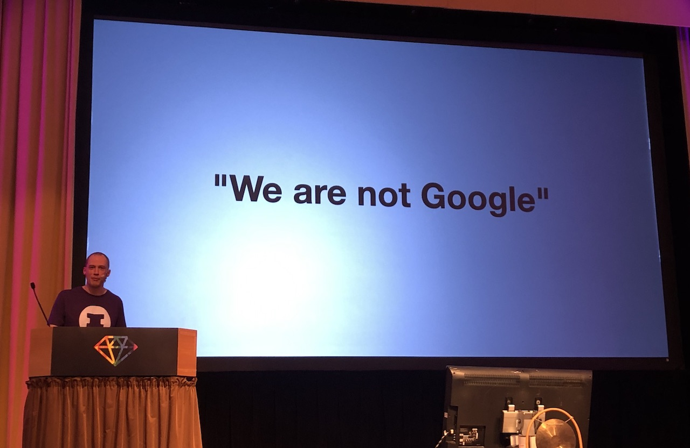
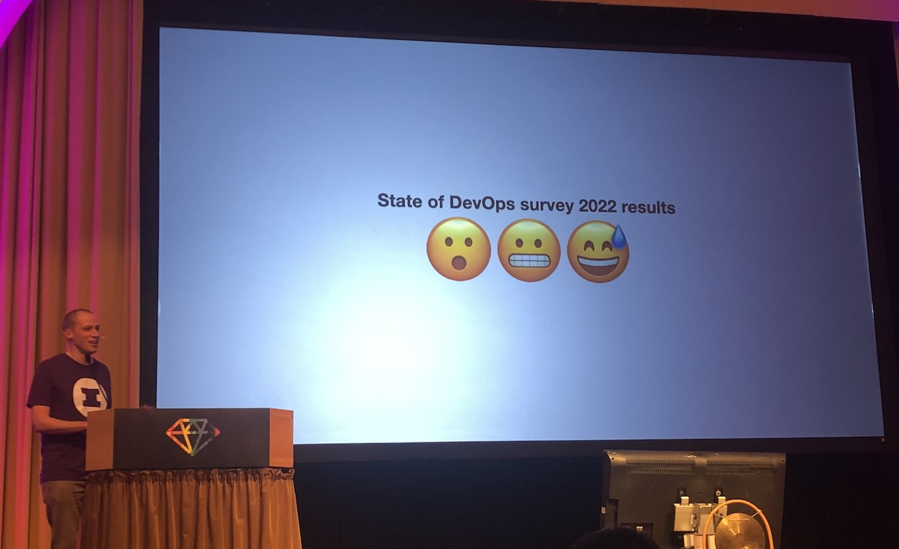

[👈 Back to all talks 👈](../README.md)

---

# From massive pull requests to trunk-based development with Ruby

## Vesa Vänskä [@vesan](https://twitter.com/vesan)

You may know the pain of working with long-loved branches. Changes there tend to get really big and hard to review properly before merging. This way of working was introduced by GitHub with theri "GitHub flow" approach: create a new branch, do work there, open pull request, discuss changes and finally merge.

But it can get out of hand if branches aren't short-lived. How about a different approach. Let's learn about trunk-based development.

It can be described with 3 key points:

- Source-control branching & collaboration model
- Collaboration happens in trunk (main)
- There are no other long-lived branches

This way of working is best suited for services. Other types of applications may be easier to work with using different approaches.

There may be a few doubts about this approach. What about huge feature that will take months to build? Or how do you avoid broken code maing it to production?

Are we sure we need long-lived branches for building a new feature? We could take an alternative approach of using feature flags. Then it's safe to merge unfinished parts of a big feature, because they won't be visible until specifically enabled. One easy way to add feature flags to ruby project is with `flipper` gem.

So what about running broken code on production? If you have a CI setup and tests in your project then broken builds will not be automatically deployed, because your builds will be failing. There are multiple CI providers depending on your specific setup. It may be wise to setup moniitoring so you get notified about potential issues. It's worth looking at `ActiveSupport::Notifications` for setting up custom monitoring for individual methods.

Maybe you're worried that your team is too small to bother with this approach? With ruby a lot of setup is really easy so there isn't much overhead anyway. It may be more important to focus on your CI/CD setup. Does it need to do both of those parts? Maybe you actually only need CI?

> Any improvements made anywhere besides the bottleneck are an illusion

If you don't have issue with long-lived PRs it may not even be worth to invest time in fixing things that aren't broken. 

### Is it actually a problem?

We'll look at "State of DevOps Survey". They're running a bunch of useful metrics for figuring out how teams across the world operate. Those metrics include:

- Deployment Frequency
- Lead Time for Changes
- Change Failure Rate
- Time to Restore Service

According to those results to be a "medium tier" organization you only need to deploy between once per week and once per month. Same numbers apply for time to changes. When your service is down you may take between one day to one whole week to restore it. And failure rate between 16% - 30% still means you're a "medium tier" organization.

It seems like a lot of organizations may be struggling with those.

## Q&A

- What is a process of cleaning obsolete feature flags?

  It's not urgent to clean them up. You can leave it for future and clean it up when you have some time

- How to tackle long-running work that can't be behing feature flag? For example rails or ruby update

  This is a tricky setup. For such changes it may be helpful to stop thinking about it as an update to project, but rather as a whole new project that's run side-by-side
  
- How to handle big projects? Hundreds of developers working simultaneously?

  This is a question for one of the big companies. They may have dedicated teams that keep things running
  
- What's the good way to manage who has a feature flag enabled?

  There doesn't seem to be a consensus - just pick what works best for you

- How to allow testers access to only a single new feature?

  Depends on a setup, but usually a lot of those can be handled with feature flags
