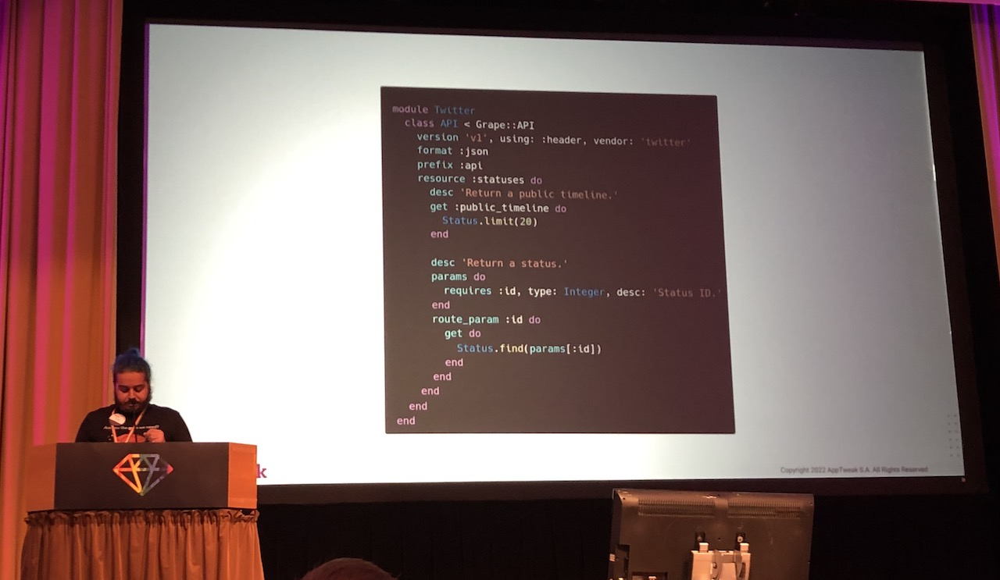
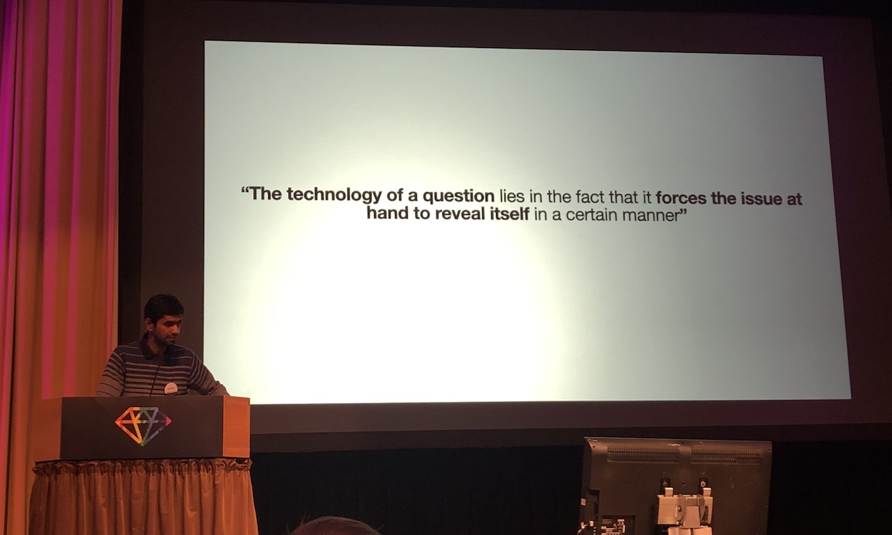
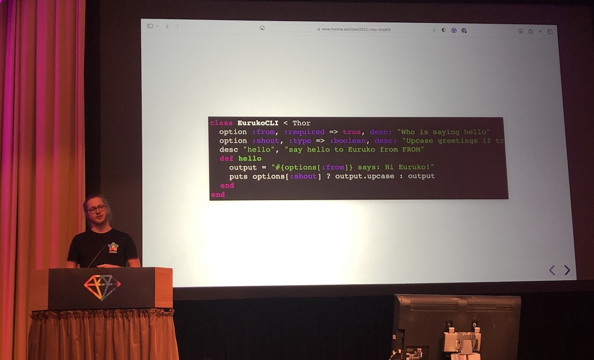
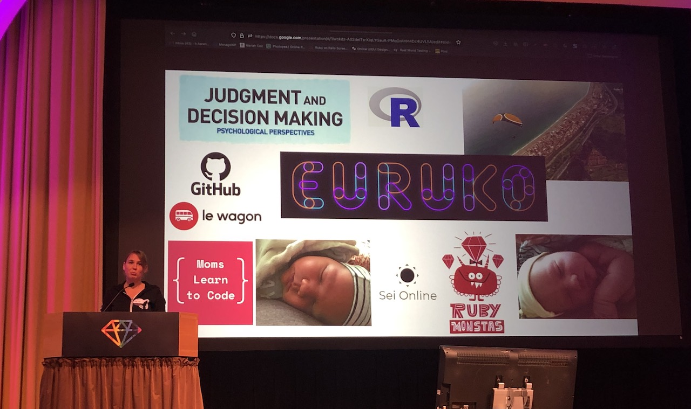

[👈 Back to all talks 👈](../README.md)

---

# Lightning talks

## Renato "Lond" Cerqueira [@renatolond](https://twitter.com/renatolond) - *From Sinatra to Grape*

Reasons to move away from Sinatra:

- Documentation - pain point
- No solution for documentation i Sinatra

Grape is a well established gem for building APIs. It has `grape-swagger` companionship gem which makes exporting documentation easy.

Initial testing confirmet that Grape would be a good fit. Some endoints would not be possible to move initially. That was solved with `Rack::Cascade` - it allows calling different APIs as fallbacks.

##  Mohnish G Jadwani [@mohnishgj](https://twitter.com/mohnishgj) - *Why bother about "Questions"?*

Asking a simple question to other people may spark their interest and create some kind of connection. Asking questions can help work together towards shared purpose.

> If you were a new superhero, what special powers would you have?

You may ask such questions in your teams, during standups, retrospectives etc. They are non-intrusive and fun way of making connections.

## Hans-Jörg Schnedlitz [@hschnedlitz](https://twitter.com/hschnedlitz) - Building Delightful Command-Line Apps in Ruby

One command line app we use regularry is `rails`. Some people agree that it's a great command line app - it has no buttons, components, but does exactly what it needst to do. There are no surprises, it shows some kind of progress so user is not left wondering if things are happening.

One great gem for building CLIs is `thor` - https://whatisthor.com/. It makes it really easy to define CLI arguments, write documentation.

Another thing is acollection of gems that can be found at https://ttytoolkit.org/. It has all kind of cool features like spinners, progress bars, and event ASCII charts.

## Hana Harencarova [@hanaharencar](https://twitter.com/hanaharencar) - Welcome Ruby juniors

We may know about struggles new developers have to go through. Junior developers should focus on the following:

- look for companies they want to work for
- find mentors
- meet other people

As their colleagues we may reach out to help them and be ready to mentor.

Companies have some responsibilities as well. They should invest in good, welcoming interviews and onboardings.

In general: just be nice!
