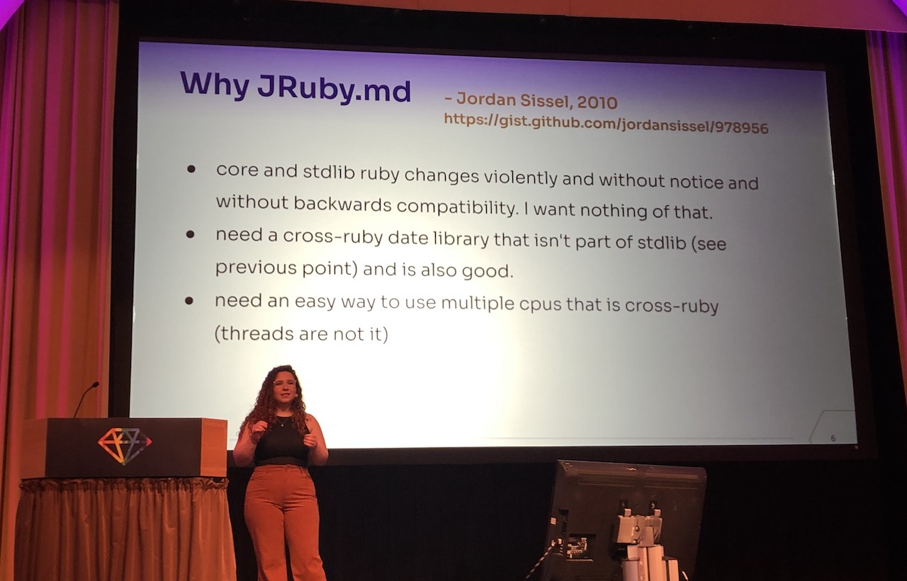
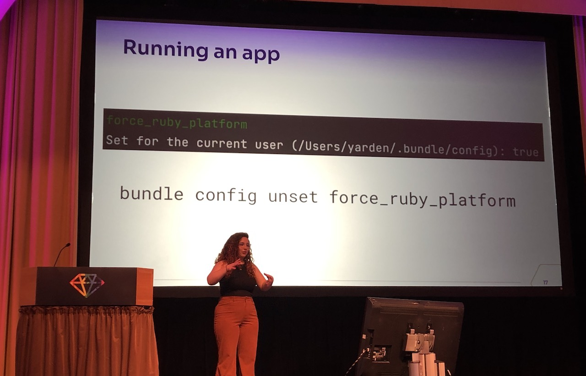
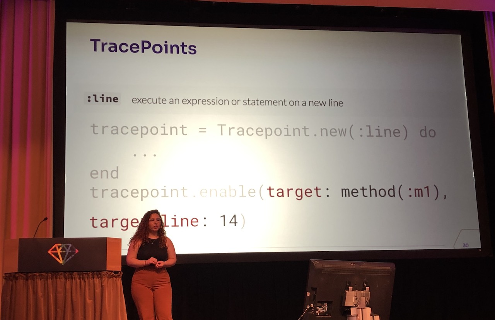
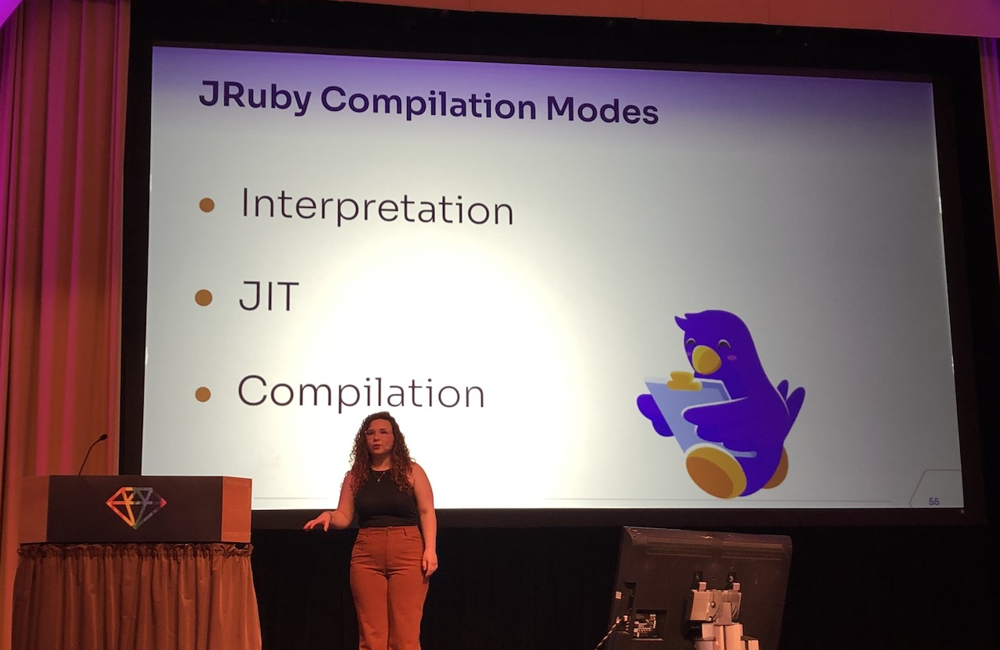

[👈 Back to all talks 👈](../README.md)

---

# Ruby & JVM: A (JRuby) Love Story

## Yarden Laifenfeld [@yardenlaif](https://twitter.com/yardenlaif)

JRuby is a 100% Java implementation of Ruby language. It comes with a few advantages:

- integration with Java libraries and ability to run Java code
- uses JVM which has good threading and support for long running applications (JVM does optimizations based on past usage)

On the other hand it has smaller community and less features that CRuby which is a default choice for most people. Currenlty, latest JRuby version only supports Ruby 2.6 and older.

### Should you use it?

As usual, it depends on what you need. Switching to JRuby is fairly easy, because in the end you're still using the same language.

We'll go through a journey of adding support for JRuby to the app. We'll run the app, add a breakpint in code and collect some data there. Setting up JRuby should be as easy as `rvm install jruby` and `ram use jruby`.

But be wary that you may run into compatibility issues when trying to install gems in some setups - espiecially when using native extensions.

Once you go over this step your app should work with no further changes.

The next step is to add a breakpoint and connect a debugger. In Ruby this is handled by `TracePoints`.

While this code works fine in CRuby it doesn't work in JRuby - this part has not been updated so it's not easy to setup breakpoints.

However, we can still use Java Instrumentation API, because we're running on top of JVM. We may need some knowledge of how JVM works to do this. The right tool to handle breakpoints in this case is called `Class Transformer`.

There are 3 compilation modes in JRuby:

- interpretation - goes through code line by line
- compilation - builds whole code to JVM bytecode before running
- JIT - a compromise between the two. For rare invocations code is interpreted, but for more often ones it gets compiled

We need to keep in mind that unless we force compilation, some of our breakpoints may not be called properly.

When running regular ruby breakpoints you get easy access to `self` and all of the local variables. When setting breakpoints from JVM it needs a little fiddling and extra code to get usable data. After this is done we have fully working app in JRuby that meets all our criteria.
