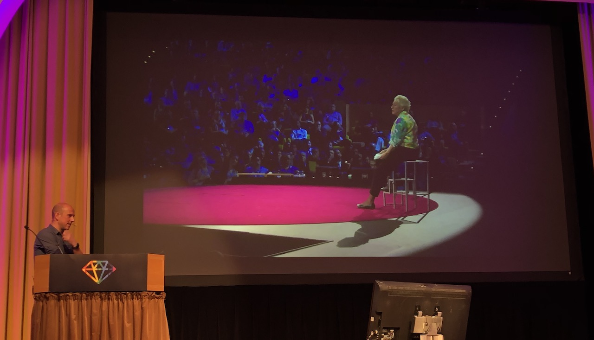
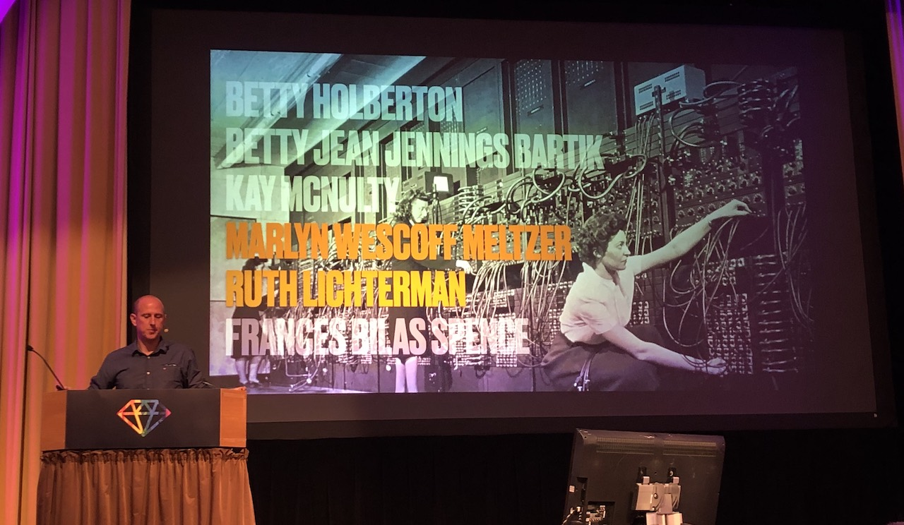
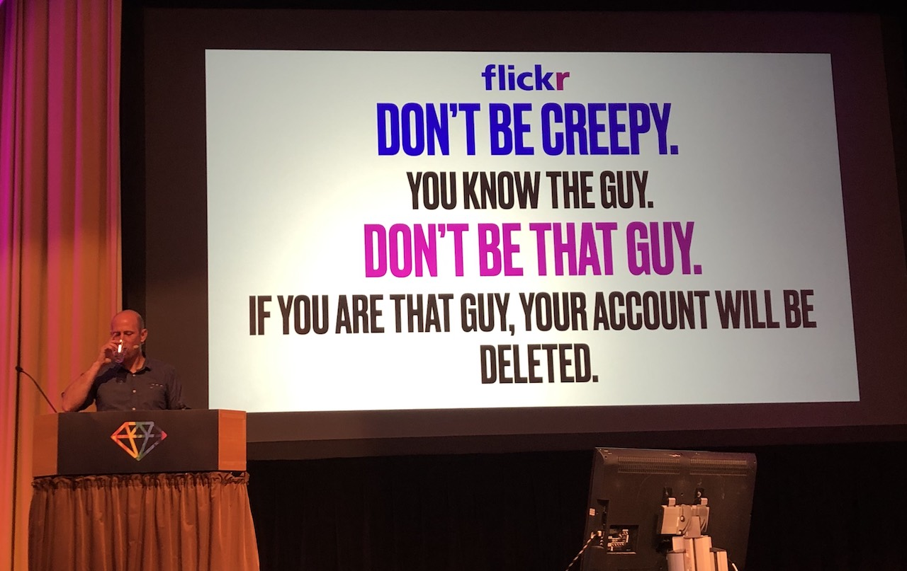
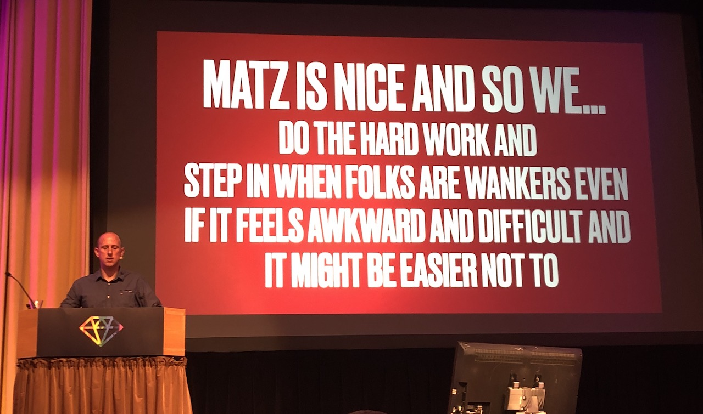

[👈 Back to all talks 👈](../README.md)

---

# Closing Keynote: The Mrs Triggs Problem

## Andy Croll [@andycroll](https://twitter.com/andycroll)

Steve Shirley incorporated "Freelance Programmers" in 1962. The company, despite rough start, turned out extremely succesful. It was also working primarily remotely, worktime was flexible and company was employee owned - all of those back in the 60s. And most of the early hires were women.

Interesting thing is - Steve Shirley was actually Stephanie Shirley. She had to go by man name to be taken seriously back in her times.

Another interesting women, Grace Hopper was a mathematics professor in USA during WW2. She was tasked with programming one of the first computers - used by military. In the meantime the first electronic computer ENIAC was built in Pensylvania. There, she met with other women who held roles similar to hers - computer programmers. Even though women were primarily working as programmer, media were not reporting it. They were giving men all the glory.

After the war, they continued to work in the industry. A team led by Grace was responsible for creating the first general purpose language - COBOL. It may not hold up with todays standards, but was groundbreaking back in it's times.

We can find many more examples of women in tech having major impact in breaking achievements. Even though their contributions were crucial, they weren't getting proper acknowledgment. Neutron star discovery? Or maybe programming flight computer for rockets going to the moon?

And it's not just history when women holding key positions are disregarded or harassed. Do you remember the 2017 sexual harassment Uber case?

Don't make assumptions. Ask!

You can find more material on this topic here: https://andycroll.com/talk/ruby/the-mrs-triggs-problem/
